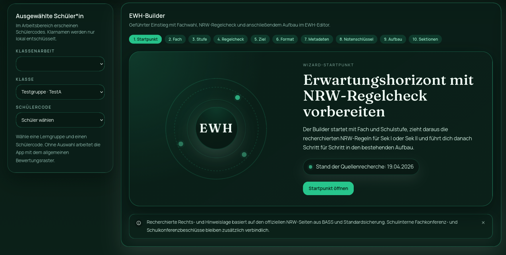

# EWH Module

Short overview of the `ErwartungshorizontStudio` module.

## Overview

This is a Vite + React module for building and reviewing student assessment rubrics (`Erwartungshorizonte`) for Sekundarstufe I+II/ Gymnasium NRW.

License summary:

- personal, educational, and other noncommercial use is allowed
- commercial use or redistribution requires a separate written license
- full terms are in [LICENSE](LICENSE)



Main capabilities:

- edit section-based assessment sheets
- manage grade scales and weighted scoring
- work with student aliases and locally encrypted student names
- create fully encrypted student-database backups for export and recovery
- save reusable rubric snapshots in the archive
- generate print-friendly report views and browser PDF exports
- switch between light/dark mode and two visual themes

## Usage Notes

Install dependencies and run locally:

```bash
npm install
npm run dev
```

Production build:

```bash
npm run build
```

Production end-check:

```bash
npm run check:release
```

Offline regression checks:

```bash
npm run test:regression
```

GitHub Pages demo build:

```bash
npm run build:demo
```

General behavior:

- draft data, archive entries, and student database state are stored in a browser-local SQLite database persisted in IndexedDB
- theme settings remain in `localStorage`
- student-facing work uses aliases in the UI; full names are only resolved locally during protected print flows
- student database backups are exported as encrypted JSON and require the chosen backup password for restore
- PDF export uses the browser print dialog, not a server-side PDF generator
- the visual theme picker changes the app palette independently of light/dark mode
- subtle one-shot UI feedback sounds are bundled locally from Kenney's CC0 `Interface Sounds` pack; license text is stored in `public/licenses/kenney-interface-sounds-license.txt`
- demo builds (`npm run build:demo`) seed a local sample exam on first start and expose a reset button so the public Pages version stays explorable without shipping real user data

## Caveats

- data is local to the current browser/profile unless exported manually
- if the browser profile is reset or the device changes, recovery depends on a previously exported backup file and its backup password
- popup and print handling depend on browser settings; blocked popups or browser-specific PDF behavior can affect export workflows
- password-protected student name decryption only works when the correct class password is available for that session
- print layouts are optimized for browser printing, so exact pagination may vary slightly between browsers
- this repository is source-available, not open-source in the OSI sense, because commercial use is restricted

## GitHub Handoff

Before publishing the repository:

- run `npm run check:release`
- keep `dist/` out of version control; the demo site is deployed through `.github/workflows/deploy-demo.yml`
- enable GitHub Pages with GitHub Actions as the source if you want the demo deployed automatically from `main`
