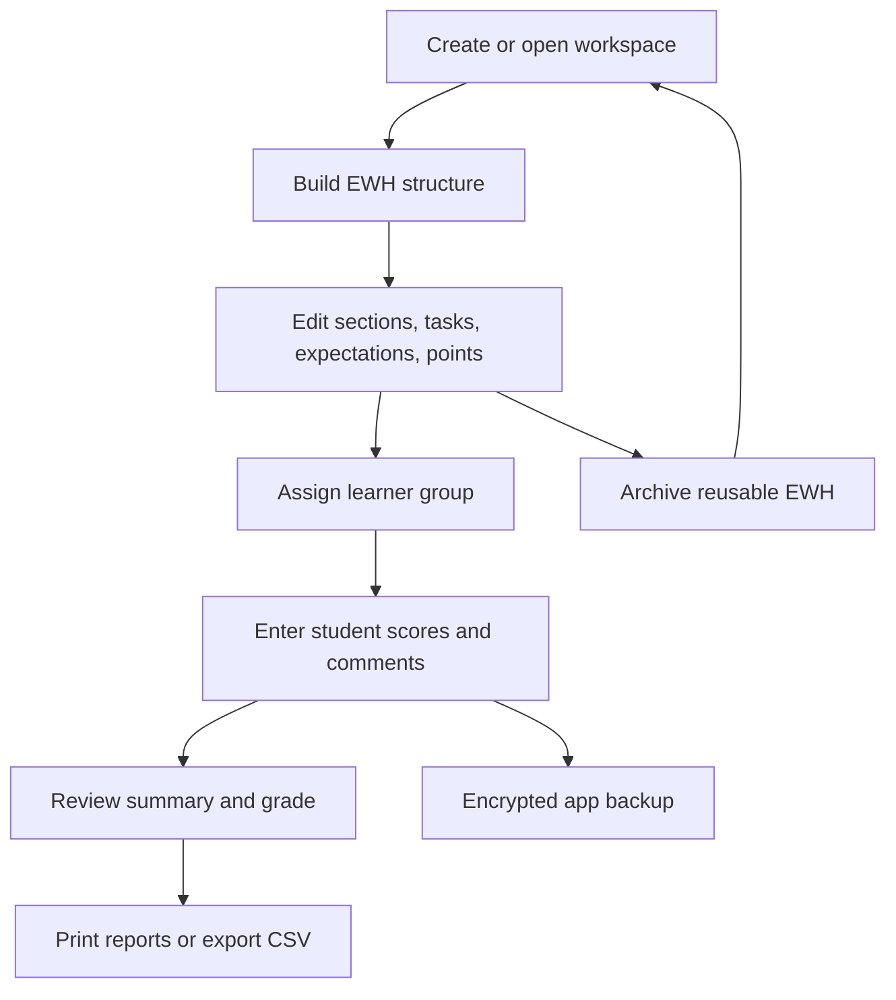
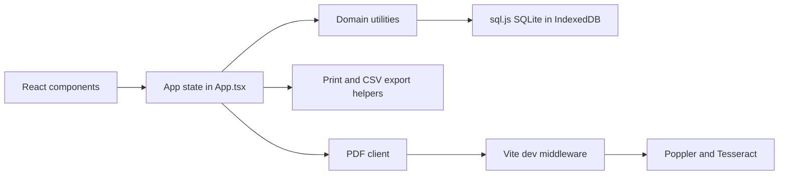

# Erwartungshorizont-Studio

Erwartungshorizont-Studio is a local-first browser application for creating, reusing, correcting, and exporting NRW-style assessment rubrics (`Erwartungshorizonte`) for Sekundarstufe I and II.

It is designed for teachers who need a practical workflow around exams: build the rubric, assign it to a class, enter student scores, generate feedback, print reports, export CSV data, and keep reusable templates without sending student data to a cloud service.

Current status: working Vite/React application with local persistence, encrypted student data, guided EWH creation, class correction workflows, archive reuse, PDF/CSV/backup exports, and a static demo mode. It is a personal, source-available tool rather than a polished multi-user product.

Probably 70% Vibe Coded.


## Documentation

- [Architecture](docs/architecture.md) explains the application structure, data flow, storage model, and major implementation decisions.
- [Diagrams](docs/diagrams.md) contains the full Mermaid ERD, PDF import ERD, architecture diagram, and correction sequence diagram for GitHub rendering.
- [Developer Guide](docs/developer-guide.md) covers setup, commands, extension points, coding conventions, and release checks.
- [Data and Privacy](docs/data-and-privacy.md) documents local storage, encryption boundaries, PDF import risks, and backup behavior.
- [AI chat test cases](docs/ai-chat-test-cases.md) contains manual scenarios for the AI help flow.

Keep these files updated with code changes. When a feature changes data flow, storage, import/export behavior, or user-facing workflow, update the matching documentation in the same change.

## What It Does

- Guided EWH builder with manual setup, subject/stage presets, bundled templates, and PDF-import-assisted structure suggestions.
- Full EWH editor for metadata, sections, tasks, expectations, point scaling, section linking, section navigation, and grade-scale editing.
- Direct point-based grading with generated grade ranges and optional Notengenerator-style settings.
- Multiple local workspaces/classes with local version snapshots.
- Reusable EWH archive with search, filters, sorting, duplication, and assignment to learner groups.
- Learner group management with generated aliases, encrypted names, absent status, manual ordering, and CSV/XLSX/ODS import.
- Protected student assessment data with encrypted comments, scores, names, and signatures when a group password is used.
- Printable student reports, empty EWH sheets, class batches, class overview reports, grade-scale reports, and security-token cards.
- CSV exports for individual students, class corrections, class overview data, and grade ranges.
- Encrypted full-app backups containing workspaces, archive entries, groups, and assessments.
- Student performance view across workspaces with history, status, and competence/radar-style comparison.
- Local theme settings, dark/light mode, and multiple visual palettes.
- Demo mode for public/static builds with seeded sample data and reset controls.

## Design Principles

Erwartungshorizont-Studio is intentionally document-oriented. The main editor keeps the full rubric in one continuous workspace because teachers often compare point totals, criteria, weights, and linked sections across the whole exam.

The UI favors:

- Dense, scannable controls over marketing-style screens.
- Local-first state and explicit backup/export workflows.
- Editable structured data over generated black-box content.
- Print-ready reports that still preserve browser-native print behavior.
- Privacy by default: aliases, local storage, optional group locks, and encrypted backups.

## Core Workflow



## Technical Overview



The browser app owns the primary workflow. Most business rules live in `src/utils/`, while `src/components/` contains reusable UI and workflow panels. PDF extraction is the main local backend-assisted feature and is implemented through Vite dev middleware.

## Tech Stack

- Vite 6
- React 18
- TypeScript 5
- Tailwind CSS
- `sql.js` for browser-local SQLite storage persisted through IndexedDB
- `xlsx` for spreadsheet imports
- Vite dev middleware for PDF text/OCR extraction and PDF structure suggestions

## Getting Started

Install dependencies:

```bash
npm install
```

Run the local app:

```bash
npm run dev
```

Build the normal production bundle:

```bash
npm run build
```

Build the seeded demo bundle:

```bash
npm run build:demo
```

Preview a built bundle:

```bash
npm run preview
```

Run the full release check:

```bash
npm run check:release
```

Run offline regression checks only:

```bash
npm run test:regression
```

There is also a convenience launcher at `scripts/start-dev.sh` that starts the Vite dev server from this project directory.

## Example Usage

### Create a New Rubric

1. Open the app with `npm run dev`.
2. Start in the guided builder.
3. Select a bundled template or define sections manually.
4. Open the EWH editor.
5. Edit section titles, descriptions, task criteria, max points, and grade scale.
6. Save a local version snapshot before larger edits.

### Correct a Class

1. Create or import a learner group.
2. Assign a workspace to the group.
3. Select a student alias.
4. Enter task scores and optional teacher comments.
5. Print the student report or export class-level CSV data.

### Reuse a Previous EWH

1. Archive a finished rubric.
2. Open the archive dashboard.
3. Search or filter by subject, class, school year, or title.
4. Duplicate the archive entry into a new editable workspace.

## Repository Layout

- `src/App.tsx` - main application shell, workspace state, tabs, import/export handlers, and correction workflow.
- `src/components/` - UI panels for builder, editor, archive, students, print summaries, signatures, and reports.
- `src/data/` - bundled templates, sample exam data, and guided-builder subject/stage presets.
- `src/utils/` - grading, scaling, backup, storage, encryption, import/export, archive, student, and validation helpers.
- `src/pdf/` - PDF import types, privacy checks, client calls, and option metadata.
- `server/` - local Vite middleware handlers for PDF extraction/suggestion and older AI helper stubs.
- `regression/` - offline regression runner used by `npm run test:regression`.
- `public/` - icons, fonts, signature asset, and bundled license notice.
- `docs/` - GitHub-facing documentation for developers and maintainers.
- `V.01/` - historical nested project copy kept in this workspace.

## PDF Import Requirements

The PDF import flow can extract embedded PDF text, fall back to OCR for scanned PDFs, show a redacted preview, flag likely sensitive data, and convert the extracted text into a cautious EWH structure suggestion.

Local PDF extraction depends on command-line tools being available to the Vite dev server:

- `pdftotext`, `pdfinfo`, and `pdftoppm` from Poppler
- `tesseract` with German and English language data (`deu+eng`) for OCR fallback

The `/api/pdf-extract` and `/api/pdf-suggest` routes are provided by Vite dev middleware in `vite.config.ts`. A static production/demo build does not provide those API routes by itself.

## Data and Privacy Model

- Draft workspaces, archive entries, and the student database are stored locally in browser SQLite persisted in IndexedDB.
- Theme settings are stored in `localStorage`.
- Student-facing correction uses aliases; full names are revealed only locally after the relevant protected group is unlocked.
- Group security tokens/passwords are not stored in clear text.
- Encrypted app backups are JSON files protected by the backup password chosen during export.
- Browser profile deletion, device changes, or IndexedDB cleanup can remove local data unless a backup was exported.
- PDF import intentionally asks for consent, shows warnings, and tries to minimize sensitive data, but users must still remove unnecessary personal data before import.

See [Data and Privacy](docs/data-and-privacy.md) for details.

## Caveats

- This is a single-browser, local-first app, not a synchronized cloud system.
- Static deployments are useful for the demo and browser-only workflows, but PDF import needs backend routes and system PDF/OCR tools.
- Print and PDF output use browser print windows, so popup blockers and browser-specific pagination can affect export results.
- Exact print pagination may vary between browsers.
- Encrypted data can only be recovered with the correct class token/password or backup password.
- This repository is source-available, not OSI open source, because commercial use and redistribution are restricted.

## License

Personal, educational, and other noncommercial use is allowed. Commercial use or redistribution requires a separate written license. See [LICENSE](LICENSE) for the full terms.
