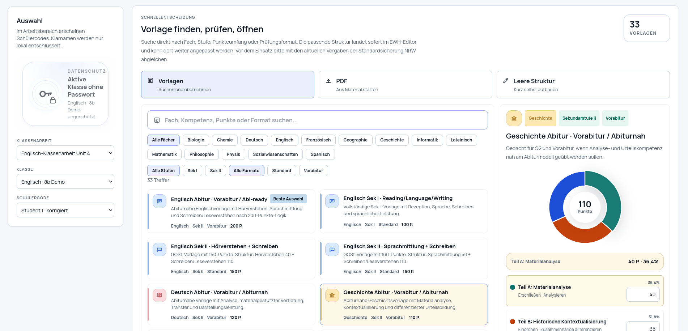

# Erwartungshorizont-Studio

Erwartungshorizont-Studio hilft Lehrkräften, Erwartungshorizonte, Lerngruppen und Korrekturen an einem Ort zu organisieren – ohne Nutzerkonto und ohne zentrale Schülerdatenbank.

[Demo öffnen](https://simonhartmannedu.github.io/Erwartungshorizont-Studio/)



## Wofür die Anwendung gedacht ist

Der Schulalltag rund um Klassenarbeiten besteht oft aus vielen kleinen, fehleranfälligen Schritten: Kriterien festlegen, Punkte nachrechnen, Listen pflegen, Rückmeldungen schreiben und den Überblick über bereits korrigierte Arbeiten behalten. EWH-Studio bündelt diese Schritte in einer lokalen Anwendung.

Damit kannst du:

- Erwartungshorizonte, Aufgaben, Punkte und Notenschlüssel erstellen und wiederverwenden;
- Lerngruppen aus CSV-, XLSX- oder ODS-Dateien übernehmen;
- Punkte, Kommentare und Unterschriften pro Schüler*in erfassen;
- Korrekturübersichten, Bewertungsbögen sowie CSV-, XLSX-, ODS- und DOCX-Dateien erzeugen;
- abgeschlossene Arbeiten archivieren und für das nächste Schuljahr wiederverwenden;
- verschlüsselte Sicherungen deines Arbeitsstands anlegen.

Die Demo enthält ausschließlich fiktive Daten.

## Warum das für Lehrkräfte praktisch ist

EWH-Studio soll keine zusätzliche Verwaltungsplattform sein. Es ist ein Werkzeug für die Zeit zwischen Aufgabenplanung, Korrektur und Rückgabe:

- Ein Erwartungshorizont kann für ähnliche Lerngruppen kopiert statt neu geschrieben werden.
- Der Notenschlüssel und die Punktesummen bleiben direkt neben den Kriterien sichtbar.
- Für jede Lerngruppe bleibt nachvollziehbar, was schon korrigiert, gedruckt oder zurückgegeben wurde.
- Berichte und Tabellen entstehen aus denselben Daten wie die Korrektur – kein doppeltes Übertragen.
- Archive helfen, bewährte Aufgabenformate über Schuljahre hinweg weiterzuentwickeln.

Langfristig entsteht so eine persönliche, gut wiederverwendbare Sammlung von Kriterien und Arbeitsständen. Die Hoheit über diese Sammlung bleibt bei dir.

## Datenschutz und Sicherheit – verständlich erklärt

Die Anwendung ist **local-first**: Arbeitsstände und Schülerdaten liegen im Browser auf deinem Gerät. Es gibt kein verpflichtendes Konto, keine Telemetrie und keinen zentralen Synchronisationsserver.

- Namen werden für geschützte Lerngruppen verschlüsselt gespeichert.
- Punkte, Kommentare und Signaturen können mit dem Gruppenpasswort geschützt werden.
- Backup-Dateien werden mit einem von dir gewählten Passwort verschlüsselt; dieses Passwort speichert die Anwendung nicht.
- Eine PDF wird erst nach einer ausdrücklichen Einwilligung verarbeitet. Die Anwendung weist vor der Übernahme auf mögliche sensible Inhalte hin.
- Bei mehreren geöffneten Tabs stoppt die Anwendung das Speichern, bevor ein neuerer Datenstand überschrieben werden könnte.

Das ersetzt keine schulische Datenschutzprüfung: Besonders auf gemeinsam genutzten Geräten solltest du geschützte Gruppen sperren, den Browser nach der Arbeit schließen und regelmäßig ein verschlüsseltes Backup außerhalb des Browserprofils ablegen.

Wichtig: Das Löschen des Browserprofils, privates Surfen, Speicherbereinigung oder ein Gerätewechsel können lokale Daten entfernen. Ein verlorenes Backup-Passwort kann nicht wiederhergestellt werden. Mehr dazu steht in [Datenschutz und Datenhaltung](docs/data-and-privacy.md).

## Schnellstart

Voraussetzung ist Node.js 24 oder eine mit Vite 6 kompatible Node-Version.

```bash
npm install
npm run dev
```

Für die normale Nutzung genügt die gehostete Demo oder eine lokale Installation. Der PDF-Import benötigt lokal zusätzlich Poppler (`pdftotext`, `pdfinfo`, `pdftoppm`) und Tesseract mit Deutsch und Englisch.

## Für die Wartung

Das Projekt ist bewusst auch für eine einzelne wartende Person überschaubar gehalten. Vor einer Änderung reichen in der Regel diese Prüfungen:

```bash
npm run lint
npm run typecheck
npm run test
npm run build
```

Bei Änderungen an Berechnung, Speicher, Import, Export oder Backups zusätzlich:

```bash
npm run test:regression
npm run test:e2e
```

Die kompakte technische Orientierung steht in [Entwicklung und Wartung](docs/development.md). Bitte niemals echte Schülerdaten, Passwörter, Schlüssel oder Backups in Commits, Tests oder Screenshots verwenden.

## Lizenz und Beiträge

Der Community-Kern ist unter [GNU Affero General Public License v3.0](LICENSE) (`AGPL-3.0-only`) lizenziert. Er bleibt lokal und ohne Cloud nutzbar. Hinweise zu Drittmaterial stehen in [THIRD_PARTY_NOTICES.md](THIRD_PARTY_NOTICES.md).

Sicherheitslücken bitte gemäß [SECURITY.md](SECURITY.md) vertraulich melden. Hinweise für Beiträge enthält [CONTRIBUTING.md](CONTRIBUTING.md).
