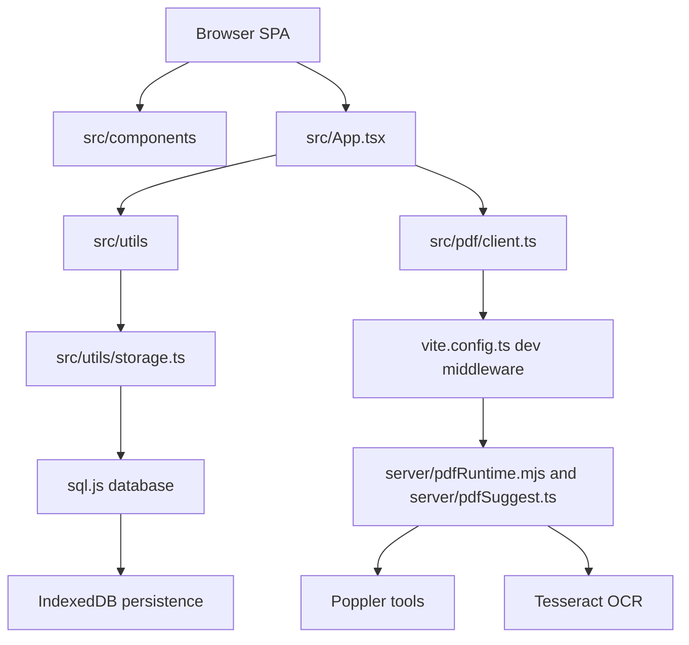
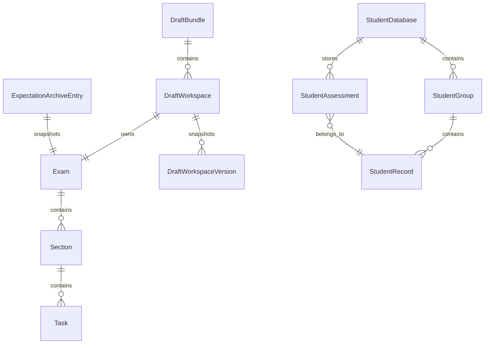
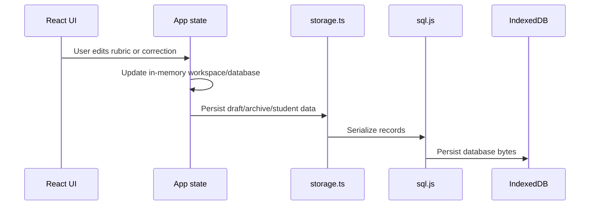

# Architecture

This document explains how Erwartungshorizont-Studio is organized and where to make common changes.

For the full GitHub-renderable Mermaid diagrams, including the complete entity relationship diagram and expanded architecture diagram, see [Diagrams](diagrams.md).

## Application Shape

Erwartungshorizont-Studio is a local-first single-page application. The primary runtime is the browser. A small Vite middleware layer exists for local PDF extraction and PDF-based structure suggestions.



## Main Modules

### `src/App.tsx`

`App.tsx` is the orchestration layer. It owns the active tab, selected workspace, selected learner group, selected student, modal states, import/export commands, and most user workflows.

Use it for:

- Connecting UI panels to application state.
- Applying updates to the active exam/workspace.
- Coordinating class/student correction workflows.
- Triggering imports, exports, print windows, backups, and restore flows.

Avoid adding low-level business rules here when they can live in `src/utils/`.

### `src/components/`

Components are grouped by workflow rather than by generic UI category. Examples:

- `GuidedExamBuilder.tsx` creates or imports an initial exam structure.
- `SectionEditor.tsx`, `TaskTable.tsx`, and `EditorToc.tsx` form the EWH editor.
- `StudentRosterPanel.tsx` and `StudentSelectionPanel.tsx` manage class and student context.
- `ReportSummarySection.tsx`, `PrintableReport.tsx`, and export helpers support reports.
- `ui.tsx` contains shared low-level controls such as cards, fields, number inputs, textareas, badges, and callouts.

### `src/utils/`

This folder contains the domain logic. Important areas:

- `calculations.ts` computes section and exam summaries.
- `grades.ts`, `gradeScaleGenerator.ts`, and `gradeScaleRanges.ts` handle grade thresholds.
- `scaling.ts` rescales points.
- `sectionWeights.ts` compares section weights with actual point totals.
- `writing.ts` handles writing/language section metrics.
- `storage.ts` persists local data.
- `backup.ts` creates and parses encrypted app backups.
- `crypto.ts` wraps browser crypto primitives.
- `students.ts` manages class groups, aliases, scores, signatures, comments, and protected assessment hydration/scrubbing.
- `export.ts` creates print windows and CSV downloads.
- `validation.ts` reports exam consistency issues.

Prefer adding testable pure logic here instead of embedding it in React components.

### `src/data/`

This folder contains templates, sample/demo data, and guided-builder research presets. Template entries are executable data: each template has metadata, preview data, and a `build()` function returning an `Exam`.

### `src/pdf/` and `server/`

`src/pdf/` contains browser-side types, privacy checks, option metadata, and API calls. `server/` contains local extraction/suggestion handlers used through Vite dev middleware.

PDF import is intentionally isolated because it is the part of the app most likely to need deployment-specific backend work.

## Data Model

The central data types live in `src/types.ts`. The compact diagram below shows the core persistent entities. The full ERD, including derived summary classes and PDF import classes, is maintained in [Diagrams](diagrams.md).



Important boundaries:

- `Exam` is the editable rubric and grading configuration.
- `DraftWorkspace` wraps an `Exam` with labels, group assignment, active archive reference, and versions.
- `StudentDatabase` stores groups, student records, and assessments.
- `ExpectationArchiveEntry` stores reusable snapshots of finished rubrics.

## Editor Navigation

The EWH editor intentionally uses continuous scrolling instead of section pagination.

Reasons:

- Teachers compare sections, weights, and point totals across the whole exam.
- Linked sections can be rendered together while remaining separate in calculations.
- The right-side `EditorToc` provides fast navigation and active-section tracking.
- Section-level collapse controls reduce visual noise without hiding the document model behind pages.

Task-level TOC anchors are shown only for large sections to avoid overwhelming normal exams.

## Storage Flow



The app is local-first. There is no sync server in the current architecture.

## Import and Export Flow

```mermaid
flowchart LR
  PDF[PDF file] --> Consent[Consent and privacy preview]
  Consent --> Extract[/api/pdf-extract]
  Extract --> Suggest[/api/pdf-suggest]
  Suggest --> Builder[Guided builder review]
  Builder --> Workspace[Editable workspace]

  Workspace --> Print[Print windows]
  Workspace --> CSV[CSV exports]
  Workspace --> Backup[Encrypted JSON backup]
  Workspace --> Archive[Reusable archive snapshot]
```

## Implementation Guidelines

- Keep domain calculations in `src/utils/`.
- Keep components focused on rendering and user interaction.
- Preserve local-first behavior unless a change explicitly introduces backend requirements.
- Update `src/types.ts`, storage migrations/normalizers, backup handling, and docs together when persistent data changes.
- Run `npm run build` for type and bundle verification.
- Run `npm run test:regression` when changing calculations, storage, archive behavior, export behavior, imports, grades, or student workflows.
