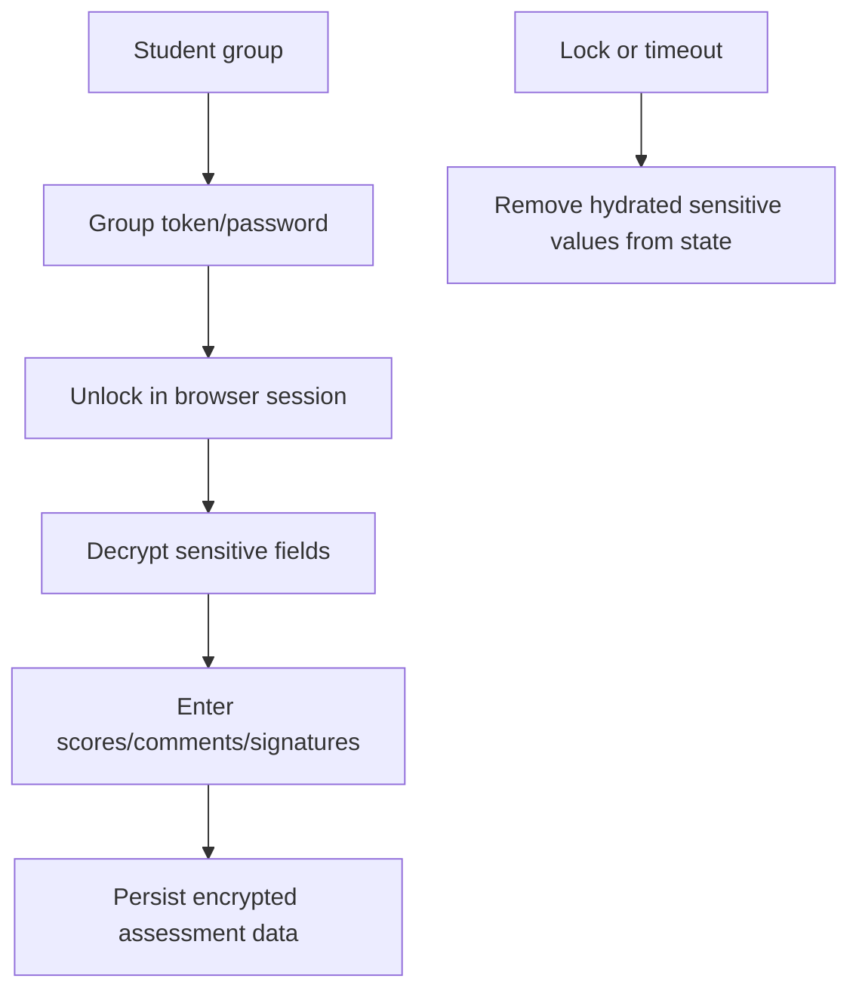

# Data and Privacy

Erwartungshorizont-Studio is local-first. The current app does not provide multi-user sync or a hosted student-data backend. This document explains where data is stored, what is encrypted, and what developers must preserve when changing privacy-sensitive code.

## Storage Locations

| Data | Location | Notes |
| --- | --- | --- |
| Draft workspaces | Browser SQLite via `sql.js`, persisted in IndexedDB | Contains editable exams and local versions. |
| EWH archive | Browser SQLite via `sql.js`, persisted in IndexedDB | Contains reusable exam snapshots. |
| Student database | Browser SQLite via `sql.js`, persisted in IndexedDB | Contains groups, aliases, encrypted names, assessments, comments, and signatures. |
| Theme settings | `localStorage` | Non-sensitive UI preferences. |
| Backups | User-downloaded JSON file | Encrypted when exported through the app backup flow. |
| Print windows | Browser popup/print context | Temporary output generated client-side. |

Browser profile deletion, storage cleanup, private browsing mode, or device changes can remove local data. Users should export encrypted backups for recovery.

## Protection Model

The app uses local aliases and optional group protection.

Important behaviors:

- Student aliases remain usable without revealing real names.
- Protected group names and assessment details are decrypted only after unlock.
- Group tokens/passwords are not stored in clear text.
- Locking a group scrubs hydrated sensitive assessment data from active state.
- Encrypted backups need the backup password chosen during export.

## Sensitive Data

Potentially sensitive fields include:

- Student names.
- Task scores tied to a student.
- Teacher comments.
- Signature data URLs.
- Imported student lists.
- PDF text containing names or identifying details.

When changing student workflows, keep hydration/scrubbing paths in `src/utils/students.ts` intact.

## PDF Import Privacy

PDF import has additional risk because source documents may contain personal data. The app mitigates this through:

- Consent-oriented import flow.
- Text extraction preview.
- Privacy warnings.
- Redaction-oriented checks in `src/pdf/privacy.ts`.
- Local Vite middleware rather than a remote PDF service in the current setup.

Developers should not bypass the preview/consent step when changing PDF import. Users remain responsible for removing unnecessary personal data before import.

## Backups

The full app backup can include:

- Workspaces.
- Archive entries.
- Student groups.
- Student assessments.
- Export timestamp.

Backups are designed as user-controlled files. Treat backup parsing as an import boundary:

- Validate structure before applying.
- Show an import preview.
- Keep rollback behavior working.
- Do not silently overwrite active local data.

## Deployment Notes

Static hosting is suitable for demo mode and browser-only workflows. PDF import requires backend routes equivalent to the local Vite middleware plus Poppler/Tesseract availability.

If the app is deployed beyond local use, document:

- Where PDF processing happens.
- Whether any student data leaves the browser.
- Which logs may contain request metadata.
- How backups and browser storage are handled.

## Developer Checklist for Privacy-Sensitive Changes

- Does the change introduce a new field containing student data?
- Is the field included in encryption/hydration/scrubbing where appropriate?
- Does backup export/import preserve it safely?
- Does print/export expose it intentionally?
- Does demo mode avoid real personal data?
- Is the behavior documented in README or this file?
