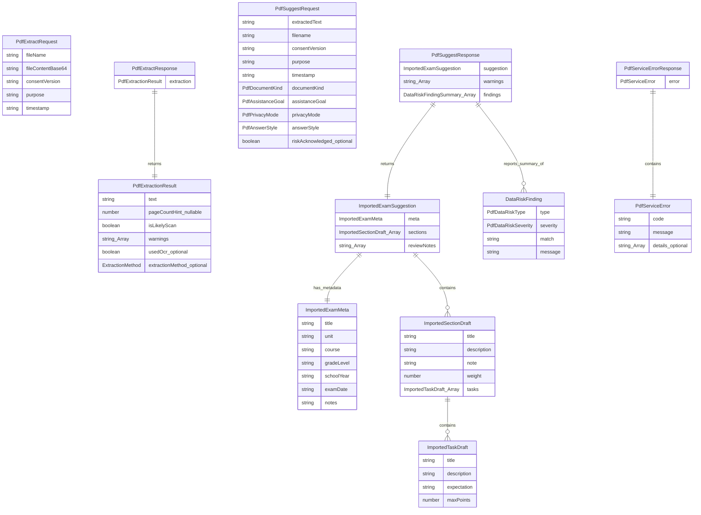
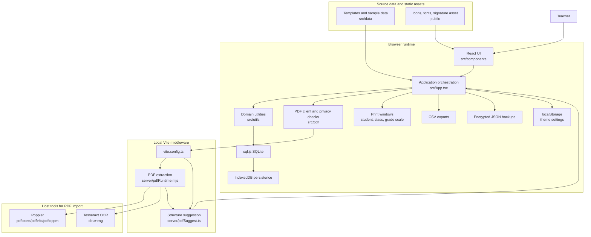
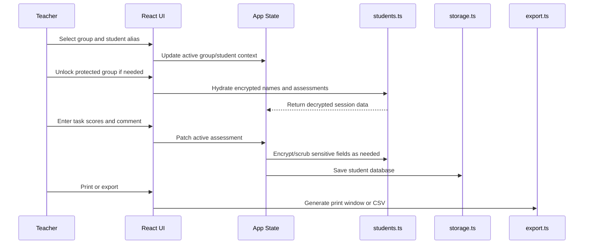

# Diagrams

This page contains GitHub-renderable Mermaid diagrams for Erwartungshorizont-Studio. Keep these diagrams synchronized with `src/types.ts`, `src/pdf/types.ts`, and the main application architecture.

## Entity Relationship Diagram

The main ERD covers the persistent and derived application data types from `src/types.ts`.

```mermaid
erDiagram
  DraftBundle {
    string activeWorkspaceId
    DraftWorkspace_Array workspaces
  }

  DraftWorkspace {
    string id
    string label
    string activeArchiveEntryId_nullable
    string assignedGroupId_nullable
    string updatedAt
    Exam exam
    DraftWorkspaceVersion_Array versions
  }

  DraftWorkspaceVersion {
    string id
    string savedAt
    Exam exam
  }

  ExpectationArchiveEntry {
    string id
    string examId
    string examTitle
    string schoolYear
    string gradeLevel
    string course
    string teacher
    string examDate
    number sectionCount
    number totalMaxPoints
    number expectationCount
    string summaryText
    string createdAt
    Exam examSnapshot
  }

  Exam {
    string id
    EvaluationMode evaluationMode
    ExamMeta meta
    GradeScale gradeScale
    Section_Array sections
    PrintSettings printSettings
  }

  ExamMeta {
    string schoolYear
    string gradeLevel
    string course
    string teacher
    string examDate
    string title
    string unit
    string notes
  }

  Section {
    string id
    string title
    string description
    number weight
    string linkedSectionId_nullable
    number maxPointsOverride_nullable
    string note
    Task_Array tasks
  }

  Task {
    string id
    string title
    string description
    string category
    number maxPoints
    number achievedPoints
    string expectation
  }

  GradeScale {
    string id
    string title
    GradeScaleMode mode
    SchoolMode schoolMode
    string commentTemplate
    GradeBand_Array bands
    GradeScaleGeneratorSettings generator
  }

  GradeBand {
    string id
    string label
    string verbalLabel
    number lowerBound
    string color
  }

  GradeScaleGeneratorSettings {
    GradeScaleSource source
    number thresholdPercent
    GradeAccumulationMode accumulationMode
    boolean useHalfPoints
    boolean showTendency
    GradeScaleRecommendedStage recommendedStage_nullable
  }

  PrintSettings {
    boolean showExpectations
    boolean showTeacherComment
    boolean compactRows
    boolean showWeightedOverview
  }

  StudentDatabase {
    number version
    string updatedAt
    StudentGroup_Array groups
    StudentAssessment_Record assessments
  }

  StudentGroup {
    string id
    string subject
    string className
    EncryptedText passwordVerifier_nullable
    string defaultSignatureDataUrl_optional
    string createdAt
    string updatedAt
    StudentRecord_Array students
  }

  StudentRecord {
    string id
    string alias
    boolean isAbsent_optional
    string createdAt
    EncryptedText encryptedName
  }

  StudentAssessment {
    string workspaceId_nullable
    string studentId
    TaskScore_Record taskScores
    EncryptedText encryptedTaskScores_optional
    string teacherComment
    string signatureDataUrl_nullable
    EncryptedText encryptedTeacherComment_optional
    EncryptedText encryptedSignatureDataUrl_optional
    string updatedAt
    string printedAt_nullable
  }

  EncryptedText {
    string ciphertext
    string iv
    string salt
  }

  ExamSummary {
    number totalMaxPoints
    number totalAchievedPoints
    number rawPercentage
    number weightedPercentage
    number finalPercentage
    SectionResult_Array sectionResults
    GradeResult grade
    NextGradeProgress nextGradeProgress
    ValidationIssue_Array issues
  }

  SectionResult {
    string sectionId
    number maxPoints
    number achievedPoints
    number percentage
    number weightedPercentage
  }

  GradeResult {
    string label
    string verbalLabel
    number lowerBound
    string schoolDisplay
  }

  NextGradeProgress {
    number currentValue
    number nextValue_nullable
    number currentBandProgress
    number pointsNeeded
    string nextGradeLabel_nullable
    string nextGradeVerbalLabel_nullable
  }

  ValidationIssue {
    string id
    IssueLevel level
    string message
  }

  ClassOverviewData {
    number studentCount
    number averagePercentage
    number medianPercentage
    number bestPercentage
    number lowestPercentage
    number averageGrade
    ClassOverviewGradeDistributionItem_Array gradeDistribution
    ClassOverviewSectionDistributionItem_Array sectionDistribution
    ClassOverviewTaskDistributionItem_Array taskDistribution
  }

  ClassOverviewGradeDistributionItem {
    string label
    string display
    number count
    string color
  }

  ClassOverviewSectionDistributionItem {
    string sectionId
    string title
    number achievedPoints
    number maxPoints
    number percentage
    string color
  }

  ClassOverviewTaskDistributionItem {
    string taskId
    string sectionId
    string sectionTitle
    string taskTitle
    number achievedPoints
    number maxPoints
    number percentage
  }

  PointScalingPreview {
    number originalTotal
    number targetTotal
    number factor
  }

  SelectedStudentContext {
    string groupId
    string studentId
  }

  DraftBundle ||--o{ DraftWorkspace : contains
  DraftWorkspace ||--|| Exam : owns
  DraftWorkspace ||--o{ DraftWorkspaceVersion : has_versions
  DraftWorkspaceVersion ||--|| Exam : snapshots
  DraftWorkspace }o--o| StudentGroup : assigned_to
  DraftWorkspace }o--o| ExpectationArchiveEntry : sourced_from
  ExpectationArchiveEntry ||--|| Exam : snapshots

  Exam ||--|| ExamMeta : has_metadata
  Exam ||--|| GradeScale : uses
  Exam ||--|| PrintSettings : configures_print
  Exam ||--o{ Section : contains
  Section ||--o{ Task : contains
  Section }o--o| Section : links_to

  GradeScale ||--o{ GradeBand : contains
  GradeScale ||--|| GradeScaleGeneratorSettings : has_generator

  StudentDatabase ||--o{ StudentGroup : contains
  StudentGroup ||--o{ StudentRecord : contains
  StudentGroup }o--o| EncryptedText : password_verifier
  StudentRecord ||--|| EncryptedText : encrypted_name
  StudentDatabase ||--o{ StudentAssessment : stores
  StudentAssessment }o--|| StudentRecord : belongs_to
  StudentAssessment }o--o| DraftWorkspace : references
  StudentAssessment }o--o| EncryptedText : encrypted_scores
  StudentAssessment }o--o| EncryptedText : encrypted_comment
  StudentAssessment }o--o| EncryptedText : encrypted_signature

  ExamSummary ||--o{ SectionResult : includes
  ExamSummary ||--|| GradeResult : includes
  ExamSummary ||--|| NextGradeProgress : includes
  ExamSummary ||--o{ ValidationIssue : reports
  SectionResult }o--|| Section : summarizes

  ClassOverviewData ||--o{ ClassOverviewGradeDistributionItem : includes
  ClassOverviewData ||--o{ ClassOverviewSectionDistributionItem : includes
  ClassOverviewData ||--o{ ClassOverviewTaskDistributionItem : includes
  ClassOverviewSectionDistributionItem }o--|| Section : summarizes
  ClassOverviewTaskDistributionItem }o--|| Task : summarizes

  SelectedStudentContext }o--|| StudentGroup : selects
  SelectedStudentContext }o--|| StudentRecord : selects
```

## PDF Import Entity Relationship Diagram

This ERD covers the PDF import request/response and suggestion types from `src/pdf/types.ts`.

## Architecture Diagram

This architecture diagram shows the runtime layers, browser storage, local middleware, and outputs.

## Correction Workflow Diagram

